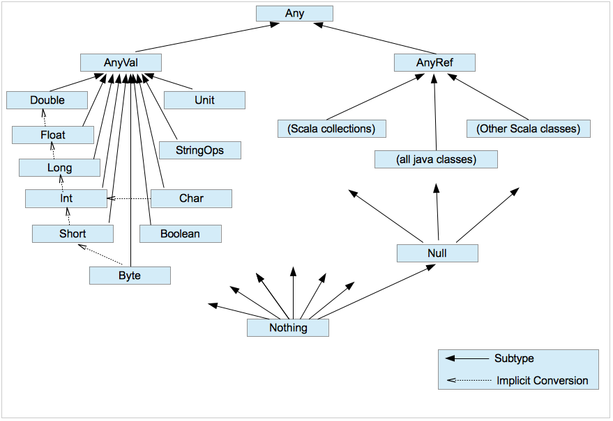

# 자바 개발자를 위한 Scala  
> **대상** : 이 글은 자바에 익숙하며, 스칼라로 당장 개발해야 하는 자바 개발자를 위해 쓰여졌습니다.  
> **목표**  
> Scala의 기본적인 문법과 서비스에서 주로 쓰일 라이브러리, 주의사항 등을 다룹니다.   
> 또한, 자바를 기준으로 스칼라의 구현체계 및 방식에 관해 설명합니다.  
  
## 타입 및 변수  
### 타입들  
* 일반적으로 알고 있는 타입들 : Int, Float, Double, Byte, Char, Boolean  
* Java에서는 예약어인 void, null  
Scala에서는 Unit (void와 비슷함), Null (null과 비슷함), Nothing, Nil의 타입으로 정의되어 있다. 모든 것들이 타입으로 정의되어 있다.  
  
### 변수 선언  
* Scala의 변수 선언을 보기전에, Java의 변수 선언을 생각해보자.  
```scala  
String str = "Hello"  
Integer num1 = 1;  
```  
* Javascript의 변수 선언과 비교해보자.  
```javascript  
var str = "Hello"  
var num1 = 1  
```  
* Scala는 Javascript와 같은 dynamic type 언어처럼 편하게 사용하되, Java와 같은 Strict type의 **장점**을 살리고자 하는 언어이다.  
> **장점**  
> Compile time에 오류를 발견할 수 있다.  
> IDE의 도움을 받을수 있다.  
  
{:height="50%" width="50%"}  
  
* 그래서 아래와 같이 dynamic type 언어처럼 선언하되, 타입 생략이 가능하다.  
```scala  
val num1: Int = 1 // 타입을 기술  
val num2 = 2 // 타입을 생략  
```  
* 타입이 생략된 변수들은 어떻게 처리되나?  
-> 실제 타입 추론은 compile time에 일어난다.  
*  변수 선언 방법은 2가지가 있다. 하나는 var, 다른 하나는 val을 이용하는 것이다.  
**var** : mutable variable (var)  
**val** : immutable value (val)  
```scal  
var num1: Int = 1  
val num2: Int = 2  
  
num1 = 2  
num2 = 1 // ERROR!  
```  
-> 둘 다 사용 가능하나, 함수형 프로그래밍(functional programming)의 특성을 살려  immutable하게 **val을 사용하자**  
### 정리  
1. 스칼라의 변수 선언은 다음과 같이 한다  
`val n: Int = 1`  
2. var를 쓸수 있으나 쓰지말자  
  
## 제어문  
### If  
* Java의 if 문을 생각해보자  
```java  
String str = null;  
if (num > 10) str = "bigger";  
else str = "smaller";  
```  
* Scala도 아래처럼 구현할 수 있으나,   
구현시 **var**를 사용하고 있다면, 내가 산으로 가고 있는 것은 아닌지 한번 정도 고민해보자.  
그럼 어떻게 해야 될까?  
```scala  
var str = "";  
if (num > 10) str = "bigger";  
else str = "smaller";  
```  
* Scala의 *if-else 문은 값을 리턴한다.* 아래와 같이 수정해보자.  
```scala  
val str = if (num > 10) "bigger" else "smaller"  
```  
* 값을 리턴한다는 것이 어떤 의미가 있을까?  
If-else는 statement가 아니라 expression이다.  
**statement** : 컴퓨터가 수행하는 명령 단위  
**expression** : 값을 생성하거나 리턴.  
-> **모든 expression은 항상 같은 값을 리턴하므로, 값으로 치환하거나 합성 가능하다. 이는 대수방정식을 풀때처럼 함수적으로 프로그래밍이 가능하다는 것을 의미한다.**  
Scala에서는 definition을 제외한 모든 식이 expression이다 (statement가 존재하지 않는다)  
### for  
* Java의 for문을 생각해보자.  
```java  
for (int item : list) {  
	System.out.println(item);  
}  
```  
* 물론 아래와 같이 구현할 수 있으나 이렇게 사용할 일이 없다.  
Scala의 for는 우리가 생각했던 그 for문이 아니다.  
무엇이 다른지는 아래에서 살펴보고, 일단 for가 있다는 사실만 알아두자.   
```scala  
for (item <- list) {  
	print(item)  
}  
```  
* 또한 If-else와 마찬가지로 값을 반환한다.  
```scala  
val list = List(1,2,3)  
val increased = for (item <- list) yield (item + 1)  
// increased = List(2,3,4)  
```  
### case  
* Java의 switch-case 문과 같은 match-case가 있으나, break가 따로 없다   
어느 case에도 해당되지 않은 값이라면 에러를 발생시킨다  
```scala  
num match {  
  case 1 => "one"  
  case 2 => "two"  
  case _ => "many" // switch-case의 default와 같은 역할을 한다  
}  
```  
* 자바의 switch-case보다 더 다양한 기능이 있으나, 지금은 match-case라는 것이 있다는 것만 알아두자.  
### 정리  
1. 스칼라의 제어문에는 if-else, for, match-case이 있다. (while, break 있으나 쓰지말자)  
2. match-case 문에는 break가 없으며, 대응되는 case가 없으면 MatchError가 발생한다.  
  
## Function  
### 선언  
* 함수 선언은 아래와 같이 한다.   
```scala  
def myFunc1(n: Int): Int = {  
  n + 1  
}  
def myFunc2(n:Int, s: String): String = {   
  s + n   
}  
```  
* return을 명시해도 되지만 따로 하지 않아도 마지막 값이 리턴된다.  
Java의 method 선언과 달라서 헛갈릴 수 있지만,   
Scala의 선언문은 변수 선언이나 함수 선언 둘 다 구조가 동일하다는 점을 기억하면 쉽다.  
  
* 변수 선언과 마찬가지로 리턴 타입을 생략할 수 있다.  
```scala  
val a = 10 // 리턴 타입 Int 생략함  
def b(n: Int) = n + 1 // 리턴 타입 Int 생략함  
```  
### Higher order function  
* 함수는 파라미터로 전달되거나 결과값으로 리턴될 수 있다.  
```scala  
def func() = {  
	def innerFunc(n: Int): String = n.toString  
	innerFunc _ // 함수를 리턴  
}  
```  
### 함수 타입  
* 현재 `func()` 의 리턴 값이 생략되어 있는데, 리턴 값은 무엇일까?  
-> **이 함수의 타입은 무엇인가?**  
```scala  
def func(): Int => String = { ... }  
```  
`Int => String` 란 Int를 인자로 받아서 String을 반환하는 함수 타입이란 의미이다.  
아래의 function type에 대해 생각해보자.  
> String => Int  
> Int => Unit  
> (Int, String, Double) => Int  
> Int => (Int, String)  
### 무명 함수 (Anonymous function)  
* 무명 함수를 정의할 수 있다.  
위에서 정의한 함수 b를  
```scala  
def b(n: Int) = n + 1  
```  
무명 함수로 정의해보자  
```scala  
(num: Int) => num + 1  
```  
### 연산전략  
* 잠깐 여기서 `=>` 기호를 살펴보자. 함수를 표현하는데 왜 `=>` 기호를 사용할까.  
아래 예를 살펴보자. (문법에 맞는 예제는 아니다. 컴파일되지 않는다, 참고만 하자)  
```  
def func(): Int = throw Exception  
a = func() // ERROR 발생.  
b => func() // 이 시점에서는 ERROR가 발생하지 않는다.  
```  
* 컴파일러 입장에서 보면 a, b 둘다 Int로 수렴하는 값일 뿐이며, **연산전략만 다르다.**  
`=>`는 `=`와 같은 할당 연산자에서 연산전략만이 다르다는 것을 표현한다.  
`=`를 사용하는 a의 경우 바로 연산하고,   
`=>`를 사용하는 b의 경우 나중에 연산한다.  
> 연산전략이 다르다는 얘기는 사실이지만 기호에 대한 내용은 추측이므로, 이해를 돕기위한 참고로만 사용하자;  
### FunctionN  
* 위와 같은 특성때문에 Scala에서는, 상속받은 함수를 변수로 변경할 수 있다.  
이것이 어떻게 가능한지 알아보기 위해 FunctionN에 관해 잠깐 살펴보자.  
* 위의 코드를 다시 살펴보자.  
``` scala  
def func(a: Int): Int => Int =  
  (b: Int) => a + b   
```  
* Scala도 결국에는 JVM 머신 위에서 동작한다.  
`Int => Int`도 Java로 실행가능한 bytecode로 변환해야 할텐데,  
그렇다면 `Int => Int`은 객체로 어떻게 표현될까.   
자바의 lambda 식을 생각해보자.  
``` java  
public Function<Integer, Integer> func(int a) {  
  return (b) -> a + b;  
}  
```  
* 위의 func의 리턴 타입은 `interface Function<T, R>`이다.  
스칼라도 비슷하게 FunctionN 객체를 사용하여 표현할 수 있다.  
```scala  
def func(a: Int) = new Function1[Int, Int] {  
  def apply(b : Int) : Int = a + b  
}  
```  
`Int => Int` 는 사실 `Function1[Int, Int]` 의 축약형이다.  
* 아래 코드는 어떻게 변환할 수 있을까?  
```scala  
def func(a: Int) = {  
  (b: Int, c: Int, d: Int, e: Int) => a + b + c + d + e  
}  
```  
* 파라미터 4개를 받는 Function4를 사용하여, 다음과 같이 변환할 수 있다.  
``` scala  
def func(a: Int) = new Function4[Int, Int, Int, Int, Int] {  
  def apply(b: Int, c: Int, d: Int, e: Int) : Int = {   
		a + b + c + d + e  
	}  
}  
```  
* 무식한 방법이지만, 이런 Function이 Function0에서 Function22까지 지정되어 있다.  
따라서 위에서 보았던 함수 타입들은 사실 FunctionN의 축약형이다.  
> String => Int   
> -> Function1[String, Int]  
> (Int, String, Double) => Int  
> -> Function3[Int, String, Double, Int]  
  
  
-> compile time에 FunctionN으로 변환되며, 우리가 직접적으로 FunctionN을 쓸 일은 없다. 참고만 해두자.  
### 함수의 할당   
* 다시 무명 함수로 돌아가보자  
```scala  
(num: Int) => num + 1  
```  
* 이제 우리는 이 함수가 Function1로 변환되는 객체라는 것을 안다.   
따라서 다음과 같이 변수에 할당할 수도 있으며  
```scala  
val a = (num: Int) => num + 1  
```  
* 다음과 같이 다시 함수로 지정할 수 있다는 것도 알수 있다.  
컴파일러 입장에서는 val이나 def가 연산 방법 이외에 크게 다르지 않기 때문이다.  
```scala  
def a = (num: Int) => num + 1  
```  
* 따라서 부모의 함수를 상속받는 경우, 변수로 재정의 가능하게 된다.  
처음보면 족보 참 엉망진창이다 싶지만.   
FP의 특성과, 변수도 함수도 객체로 변환되는 Scala를 고려한다면 당연하다고도 할 수 있다.  
### Case문과 PartialFunction  
* 이제까지 화살표가 여러개가 등장했다. 헛갈릴수 있지만 다시 정리해보면,  
첫번째는 for 문에 쓰였던 `<-`   
두번째는 match-case문에 쓰였던  `=>`   
마지막 세번째는 함수에 쓰였던  `=>`  
* 함수에 쓰였던 `=>` 이 기호는 할당 연산자 `=` 와 관계가 깊어서  `=`  기호에서 변형되었음을 설명했다.   
따라서 for 문에서는 왜 `<=` 이런 기호를 사용하지 않는지도 이해될 것이다.  
* 그렇다면 왜 함수에서 사용하는 `=>` 를 case문에 동일하게 사용하나?   
```scala  
num match {  
  case 1 => "one"  
  case 2 => "two"  
  case _ => "many"  
}  
```  
* case 문 각각이 함수이기 때문이다.   
case 문 각각은 특정 조건에만 대응하고 이외에는 Error를 발생시키는 PartialFunction이다.  
```scala  
val case1: PartialFunction[Int, String] = {  
  case n : Int if n == 1 => "one"  
}  
val case2: PartialFunction[Int, String] = {  
  case n : Int if n == 2 => "two"  
}  
  
val matchFunc = case1 orElse case2  
```  
* 왜 case문 각각이 partial function 임을 아는 것이 중요할까?  
함수를 인자로 받는 곳에 case문을 쓰는 경우가 종종 있기 때문이다.  
```scala  
items.map(item => item.id) // 이렇게도 표현하지만  
items.map { case Item(id, name) => id } // 이렇게 사용하는 경우가 많다.  
```  
### 부분 적용 함수 (Partially applied function)  
* 아래의 sum 함수를 이용하여, 값을 1을 증가시키는 inc을 만든다고 해보자  
```scala  
def sum(a: Int, b: Int) = a + b  
```  
* 물론 아래처럼 구현할 수 있으나  
```scala  
def inc(a: Int) = sum(a, 1)  
```  
* 굳이 inc라는 함수를 다시 선언하지 않는 방법이 있다.  
부분 적용함수를 이용하는 것이다.   
```scala  
val inc = sum(1, _: Int)  
```  
* sum은 Function2[Int, Int, Int]였다. `(Int, Int) => Int`  
부분 적용한 sum(1, _)은  `Int => Int`은 Function1의 새로운 함수로 리턴해준다.  
따라서 다음과 같이 사용할 수 있다  
```scala  
inc(10) // 11  
```  
### 커링 (Currying)  
* 커링이란 여러 파라미터를 가지는 함수를, 하나의 파라미터를 받는 함수 여러개로 나눈 것이다. 아래와 같은 함수가 있다고 하자.  
```scala  
def func(a: Int, b: Int) = a + b  
```  
* 이를 커링으로 (하나의 파라미터를 받는 함수로) 쪼개자면 아래와 같다.  
일단 자바에서의 구현 방법을 살펴보면  
``` java  
public static Function<Integer, Function<Integer, Integer>> add() {  
    return new Function<Integer, Function<Integer, Integer>>() {  
        @Override  
        public Function<Integer, Integer> apply(final Integer x) {  
            return new Function<Integer, Integer>() {  
                @Override  
                public Integer apply(Integer y) {  
                    return x + y;  
                }  
            };  
        }  
    };  
}  
```  
* 람다를 이용하면 좀 더 간결하게 표현할수 있다.  
``` java  
public static Function<Integer, Function<Integer, Integer>> add() {  
    return x -> y -> x + y;  
}  
```  
* 스칼라에서도 커링을 사용할 수 있다.  
아래와 같이 하나의 첫번째 인자를 받는 함수를 정의하고, 내부에서 다시 함수를 반환할 수 있다.  
```scala  
def add(a: Int): Int => Int = (b: Int) => a + b  
```  
* 다음 함수의 리턴 타입은 무엇일까?  
```scala  
def add(a:Int) =   
	(b: Int) =>   
		(c: Int) =>   
			(str: String) => (a + b + c).toString + str  
```  
-> Int => Int => Int => String => String  
* 위처럼 인자가 많은 경우 가독성이 떨어질수 밖에 없다.   
아래와 같이 간단하게도 정의 가능하다.  
```scala  
def add(a: Int)(b: Int)(c: Int)(str: String): String = (a + b + c).toString + str  
```  
* 위에서 본 부분 적용 함수의 예를 생각해보자  
```scala  
def sum(a: Int, b: Int) = a + b  
val inc = sum(1, _: Int)  
```   
* 커링으로 표현한다면 다음과 같다  
```scala  
def sum(a: Int)(b: Int) = a + b  
val inc = sum(1)  
```  
### 정리  
1. 함수 선언은 다음과 같이 한다. (return 생략 가능하다)  
```scala  
def func(n: Int): String = {  
	n.toString  
}  
```  
2. 무명 함수 선언은 다음과 같이 한다  
```scala  
(n: Int) => n.toString  
```  
3.  함수 타입은 다음과 같이 표현된다.  
```  
Int => Int  
String => Unit  
(Int, String) => Int  
Int => Int => Double => String   
```  
4. 부분적용함수와 커링을 사용하여 함수를 재활용할 수 있다.  
```scala  
def sum1(a: Int, b: Int) = a + b  
def sum2(a: Int)(b: Int) = a + b  
  
sum1(1, _)  
sum2(1)  
```  
  
## Class, Object, Trait  
### Class  
* 다음과 같이 User 클래스를 자바로 선언한다고 하자.  
```java  
class User {  
	private Integer id;  
	private String name;  
  public User(Integer id, String name) {  
	  this.id = id;  
	  this.name = name;  
  }  
	public void sayHello() { System.out.println("hello"); }  
}  
```  
* 이를 Scala 버전으로 구현하면 다음과 같다.  
```scala  
class User(id: Int, name: String) {  
	def sayHello(): Unit = println("hello")  
}  

val user = new User(1, "name")
user.id // ERROR
```  
* 클래스의 내부 필드는 private이며 getter가 필요한 경우 필드 앞에 `val`을 추가한다. 
```scala  
class User(val id: Int, val name: String)  
```  
### Case class
* class 보다 많이 쓰이는 것은 case class 이다.
```scala
case class User(id: Int, name: String)
```
* case class의 모든 필드는 기본적으로 접근 가능하며, new 없이 생성 가능하다. 
또한 내용이 같은지를 비교하는 equals과 hashCode를 제공해주고 있어 다음과 같이 사용 가능하다.  
```scala
val user = User(1, "name")

user.id // OK
new User(1, "name") == new User(1, "name") // true

val copied = user.copy()
copied == user // true
``` 
* **연습문제** : 다음 java 클래스를 case class로 변경해보자. [링크](https://scastie.scala-lang.org/)
```java
class Item { 
    public Integer id;
    public Brand brand;
    
    public Item(Integer id, Brand brand) {
        this.id = id;
        this.brand = brand;
    }
}

class Brand {
    public Integer id;
    public BrandCategory brandCategory;

    public Brand(Integer id, BrandCategory brandCategory) {
        this.id = id;
        this.brandCategory = brandCategory;
    }
}

class BrandCategory {
    public Integer id;
    public String name;

    public BrandCategory(Integer id, String name) {
        this.id = id;
        this.name = name;
    }
}

new Item(1, new Brand(1, new BrandCategory(1, "a")))
``` 
* case class가 가장 유용한 것은 match-case와 같이 쓰일 때이다.
```scala
case class User(id: Int, name: String)

val user1 = User(1, "kim")
val user2 = User(2, "lee")

user1 match {
	case User(1, _) => "find user 1"
	case User(id, "lee") => "find user with name 'lee'" + id
	case _ => "other" 
}
```
* **연습문제** : 브랜드 아이디가 1인 경우에만 카테고리명을 출력하고, 그 외에는 empty를 출력하는 함수를 만들어보자.  [링크](https://scastie.scala-lang.org/karellen-kim/JW9EvSNbTCG68s2W5AFh8g)
```scala
val item1 = Some(Item(1, Brand(1, BrandCategory(3, "item1 category name"))))
val item2 = Some(Item(2, Brand(2, BrandCategory(4, "item2 category name"))))

def printOnlyBrand1Category(item: Option[Item]) = ???

printOnlyBrand1Category(item1) // item1 category name
printOnlyBrand1Category(item2) // empty
printOnlyBrand1Category(None) // empty
``` 
### Object
* object는 싱글톤 객체이다.  
```scala
object Item {
  val ERROR_CODE = "500"
}
Item.ERROR_CODE
```
* 동일한 이름의 클래스가 있다면 companion 객체가 되어, 같은 이름의 companion 클래스에서는 object 클래스의 private 변수에 접근 가능하게 된다.  
```scala
object Item {
  val ERROR_CODE = "500"
  private val TYPE_1 = "TYPE_1"
  private val TYPE_2 = "TYPE_2"
}

case class Item(id: Int, tpe: String) {
  def getType(): Int = {
    tpe match {
      case Item.TYPE_1 => 1
      case Item.TYPE_2 => 2
    }
  }
}

Item.ERROR_CODE
//Item.TYPE_1 // ERROR
```
* companion 클래스를 어디에 사용할 수 있나?  
Java 개발시 class 내부에 선언했던 static 변수들을 분리하여 같은 이름의 object 객체에 저장하는데 사용한다.  
* companion 객체의 private 변수에 접근 가능한 이유는 무엇일까?  
Object 객체는 컴파일 시점에 companion 클래스와 병합되게 된다. 따라서 실제로는 동일 클래스의 코드가 되므로 private 변수에 접근 가능한 것이 당연하게 된다.  
### Trait  
* Scala에도 abstract 키워드를 사용하여 추상 클래스를 선언할 수 있다.  
그러나 더 많이 사용되는 것은 trait 이다.  
trait은 interface와 비슷하나 일부 구현이 가능하다.  
```scala  
  trait Shape {
  def w: Int
  def h: Int
  def show(): String = s"w=${w}, h=${h}" // 일부 구현 가능
}
```  
* 왜 interface에서는 구현이 불가능하게 되어 있었는지 생각해보자.  
Diamond problem이라 불리는 문제 때문이었는데  

* 이와 같은 경우 trait에서는 하나의 trait만 main trait만을 상속하고, 다른 trait는 mix-in함으로서 이 문제를 해결한다.  
mix-in은 정확히는 상속하는 것이 아니라, 다른 코드를 포함한다는 의미에 가깝다.  
**결과적으로 하나의 trait만 상속하게 되어 이러한 문제를 해결**하게 되는데,  
따라서 여러 extends A, B, C 와 같이 표현하는 것이 아니라,   
extend A with B with C 와 같이 표현하게 된다.  
```scala
trait A {
  def func: String
}

trait A1 extends A {
  override def func: String = "A1"
}

trait A2 extends A {
  override def func: String = "A2"
}

class A1A2 extends A1 with A2
class A2A1 extends A2 with A1

val a1a2 = new A1A2
val a2a1 = new A2A1

a1a2.func // A2
a2a1.func // A1
```
### 정리 
1. class는 다음과 같이 정의한다  
```scala
class User(id: Int, name: String)
```
2. 보통은 case class를 많이 사용한다.   
case class는 내용 비교가 가능하며, pattern matching에 유용하다.  
```scala
case class User(id: Int, name: String)

new User(1, "name") == new User(1, "name") // true

user match {
	case User(id, "lee") => "find user with name 'lee'" + id
	case _ => "other" 
}
```
3. Object는 싱글톤 객체이며, 동일한 이름의 class를 companion으로 가질 수 있다.  
4. Trait은 다중 상속을 가능하게 해주며, 자바의 interface와 달리 내부 구현이 가능하다. (정확히는 다중 상속처럼 보이게 해준다)  

## Standard library  
### Option  
* Scala에서 null을 사용해도 오류가 나는 것은 아니지만, null을 사용해서는 **절대** 안된다.  
```scala  
val num: Int = null // 잘못된 코드!  
```  
* 이를 위해, Java의 Optional과 비슷한 Option이 있다.  
```scala  
val num1: Option[Int] = None  
val num2: Option[Int] = Some(1)  
```  
* 값에 어떻게 접근하나? 기본적으로는 아래과 같이 사용할 수 있다.  
이중 1번은 사용하지 말아야 하는 형태이다.  
```scala  
val num: Option[Int] = None  
  
// 1. get  
val a: Int = num.get // ERROR!!  
  
// 2. if를 사용한다  
if (num.isDefined)  
  // 오류는 아니지만, 가능한 get을 사용하지 않는 코드로 작성하자  
  num.get.toString   
else  
  "No Value"  
  
// 3. match-case를 사용한다.  
num match {  
  case Some(n) => n.toString  
  case None => "No Value"  
}  
  
// 4. fold를 사용한다.  
num.fold("No Value")(n => n.toString)  
```  
* 하지만 서비스를 개발할 때를 생각해보자.   
값이 없는 경우 default 값으로 치환하는 경우는 많지 않다.  
```scala  
def process(maybeId: Option[Int]): Option[Item] =   
	maybeId match {  
		case Some(id) => Some(itemService.get(id))   
		case None => None  
	}  
```  
* 보통 값이 있는 경우만 신경쓰고 싶으므로, 아래와 같이 구현하자. 위와 동일한 결과이다.  
```scala  
def process(maybeId: Option[Int]): Option[Item] =   
	maybeId.map(id => itemService.get(id))  
```  
### List  
* 리스트는 다음과 같이 사용할수 있다. Nil은 빈 리스트를 표현하는 방법이다.  
```scala  
val nums: List[Int] = List(1,2,3,4)  
val emptyList = Nil  
```  
* 자주 사용하게될 기능을 살펴보자.  
```scala  
// iteration  
// 특별한 경우가 아니라면 foreach를 사용하지 말자  
nums.foreach(n => print(n)) // 1234  
nums.map(n => n * 2) // List(2,4,6,8)  
// filtering  
nums.filter(n => n % 2 == 0) // List(2, 4)  
  
// 정렬한다.  
nums.sorted // List(1,2,3,4)  
// 다음과 같이 정렬 방법을 지정해줄 수도 있다.   
nums.sortBy(n => n * -1) // List(4,3,2,1)  
  
// 사이즈를 구한다  
nums.size // 4  
  
// 조합해서 사용가능하다  
nums.filter(n => n % 2 == 0).map(n => n * 2).sum // 12  
```  
* reduce하는 방법을 알아보자  
```scala  
// nums가 빈 리스트라면 Error가 발생한다. 아래처럼 사용하지 말자.  
nums.reduceLeft((sum, n) => sum + n)  
// 대신 초기값을 줄수 있는 fold를 사용하자.  
nums.foldLeft(0)((sum, n) => sum + n) // nums.sum과 동일하다  
```  
* 값을 추가하거나, 다른 리스트와 병합해보자  
```scala  
val added = 0 :: nums // List(0,1,2,3,4)  
val concat = nums ::: List(5,6,7) // List(1,2,3,4,5,6,7)  
```  
* 리스트의 특정 값에 접근하는 방법을 알아보자.  
```scala  
// nums가 빈 리스트라면 Error가 발생한다. 아래처럼 사용하지 말자.  
nums.head // 1  
// 대신 headOption을 사용한다.   
nums.headOption // Some(1)  
  
// nums가 빈 리스트라면 Error가 발생한다. 아래처럼 사용하지 말자.  
nums(2) // 3  
// 대신 drop을 사용하자.  
nums.drop(2).headOption // Some(3)  
  
// nums가 빈 리스트라면 Error가 발생한다. 아래처럼 사용하지 말자.  
nums.last // 4  
nums.lastOption // Some(4)  
  
nums.tail // List(2,3,4)  
```  
* **연습문제**  [링크](https://scastie.scala-lang.org/karellen-kim/Ugkn1RHUQfaH0JuuVHG2Qg)  
```scala  
case class Item(id: Int, name: String, price: Int, tpe: String)  
  
val items = List(  
	Item(1, "아메리카노", 5000, "COUPON"),  
	Item(2, "아이스크림 케이크", 20000, "COUPON"),  
	Item(3, "교촌치킨", 15000, "COUPON"),  
	Item(4, "맥 립스틱", 20000, "DELIVERY"),  
  Item(5, "라이언인형", 10000, "DELIVERY"),  
)  
  
// 1. 모든 상품의 가격을 가져와서 0.1을 곱한 목록을 만들어보자  
// 2. 쿠폰인 상품만 가져와 보자  
// 3. 가격 순으로 정렬해보자  
// 4. 모든 상품을 다음 Data 타입으로 바꿔보자  
case class Data(id: Int, name: String, commission: Int)  
// 5. 모든 쿠폰 상품들을 Data 타입으로 변환하고, 가격순으로 정렬해보자.  
```  
### Tuple  
* python의 튜플과 같이 여러 타입이 혼재 가능한 타입도 있다.  
```scala  
val values = (1, "str", true, 5)  
```  
* 리스트와의 차이점은 무엇일까? 타입을 살펴보자.  
리스트와 달리 타입이 그대로 유지된다.  
```scala  
val list: Seq[Any] = List(1, "str", true, 5)  
val first: Option[Any] = list.headOption  
  
val tuple: (Int, String, Boolean, Int) = (1, "str", true, 5)  
val num: Int = tuple._1  
val str: String = tuple._2  
```  
* 튜플이 쓰이는 예를 보자.
```scala
val sorted: Seq[(Item, Int)] = items
  .sortBy(_.price)
  .zipWithIndex

sorted.map {
  data => {
    val item = data._1
    val index = data._2

    (index, item.name)
  }
}
```
* 앞서 배웠던 partial function, pattern matching을 이용하여 더 나은 코드로 작성해보자.  
```scala
sorted.map { case (item, index) => (index, item.name) }
```
* 튜플은 값을 추가하거나, 다른 튜플과 병합하거나 할 수 없다.  
왜 일까? 튜플과 같이 각각의 타입을 유지하는 목록을 자바로 구현한다고 생각해보자.  
```java  
class Tuple<A, B, C> {  
	A a;  
	B b;  
	C c;  
	public Tuple(A a, B b, C c) { ... }  
}  
  
new Tuple<Int, String, Boolean>(1, "str", true)  
```  
* 스칼라의 구현 방식도 크게 다르지 않다.  
튜플또한 함수와 같이 Tuple1 ~ Tuple22까지 존재한다.  
```scala  
case class Tuple3[+T1, +T2, +T3](_1: T1, _2: T2, _3: T3)  
```  
  
* 참고 : [shapeless](https://www.scala-exercises.org/shapeless/polymorphic_function_values)  
### Map 
* Map은 다음과 같이 정의할 수 있다.  
```scala  
val map = Map((1, "a"), (2, "b"), (3, "c"))
```  
* 다음과 같이도 표현할 수 있다.  
```scala
val map = Map((1 -> "a"), (2 -> "b"), (3 -> "c"))
```
* 자주 사용하게될 기능을 살펴보자.
```scala
val map = Map((1, "a"), (2, "b"), (3, "c"))

map.get(1) // Some("a")
map.getOrElse(4, "not found") // "not found"
map.contains(4) // false
map.map { case (key, value) =>
  s"키=${key}/값=${value}"
} 
// List(키=1/값=a, 키=2/값=b, 키=3/값=c)
```
* Map을 정의할때 요소들의 모양이 튜플과 비슷한데, 이건 실제로 Map이 튜플을 사용하기 때문이다.
```scala
abstract class GenMapFactory(...) {
  def apply[A, B](elems : scala.Tuple2[A, B]*) = { ... }	
}
```
* `->`표 기호 또한 실제로는 Tuple의 alias이다.
```scala
def ->[B](y : B) : scala.Tuple2[A, B] = { ... }
```

## Monad 
* 함수형 프로그래밍에서 자주 언급되는 모나드에 관해 알아보자.  
과연 모나드란 무엇일까? 
* Option의 예를 살펴보자.
어떤 Option값이 주어졌을때, 물론 매번 해당 값이 존재하는지 확인하여 (isDefined) 계산할 수 있으나,
```scala
val num: Option[Int] = Some(1)

if (num.isDefined) { // 이렇게도 할수 있지만
  Some(num.get * 2)
} else {
  None
}
```
* 이 값이 있는지 없는지 확인하는 일은 우리의 관심사가 아니다. 우리에 관심사에만 주목해보자.
```scala  
val num: Option[Int] = Some(1)  
num.map(n => n * 2)  
```  
* List도 마찬가지다.
목록을 순회하는 것은 우리의 주 목적이 아니다. 우리의 관심사만 구현해보자.  
```scala  
val num: List[Int] = List(1,2,3)  
num.map(n => n * 2)  
```  
* Future라고 다르지 않다.
결과값을 기다리던, 기다리다 실패하던 그건 우리의 주 목적이 아니다. 값이 오는 경우 – 우리가 구현해야 하는 그 목적에만 주목해보자.  
```scala  
val num: Future[Int] = Future.successful(1)  
num.map(n => n * 2)  
```  
* 여기서 문제.
F라는 타입이 있다고 하자. 그 것이 List인지 Future인지, Option인지는 아무도 모른다. 내부의 값 Int에 *2를 하려면 어떻게 해야 할까?
```scala  
val num: F[Int] = ???  
num.map(n => n * 2)  
```  
* F가 List이든 Future이든 Option 상관없다. 우리의 관심사에만 집중하면 된다. 이와 같은 것이 Monad라고 생각하면 된다.
* **연습문제** : 다음과 같은 경우가 있다고 하자. Int 값에 2를 곱하고 싶다면 어떻게 해야 하나? [링크](https://scastie.scala-lang.org/karellen-kim/DC0d6vXKQjGM47dOJOqg2Q)  
```scala  
import scala.concurrent.Future  
import scala.concurrent.ExecutionContext.Implicits.global  
  
val f: Future[List[Int]] = ???  
```  
### FlatMap  
* 다음은 일반적으로 구현하게되는 상황이다. 상품의 카테고리를 어떻게 가져올수 있을까?  
```scala  
case class Item(id: Int, name: String, categoryId: Int)  
case class Category(id: Int, name: String)  
  
def getItem(id: Int): Future[Item]= ???  
def getCategory(id: Int): Future[Category] = ???  
  
// 상품의 카테고리를 어떻게 가져올수 있을까?  
def getItemCategory(id: Int) = ???  
```  
* 아래과 같이 상품을 가져오고, 상품의 카테고리 아이디로 다시 카테고리 정보를 가져와보자.  
```scala  
def getItemCategory(id: Int): Future[Category] = {  
  getItem(id).map(  
    item => getCategory(item.categoryId)  
  )  
  // Future[Future[Category]] 타입이 달라 에러 발생!  
}  
```  
* 컴파일이 정상적으로 되게 하기 위해서는 다음과 같이 수정되어야 한다  
```scala  
def getItemCategory(id: Int): Future[Category] = {  
  getItem(id).map(  
    item => getCategory(item.categoryId)  
  ).flatten  
}  
```  
* 위 보다 좀 더 나은 코드는, map & flatten을 뜻하는 flatMap으로 바꾸는 것이다.  
```scala  
def getItemCategory(id: Int): Future[Category] = {  
  getItem(id).flatMap(  
    item => getCategory(item.categoryId)  
  )  
}  
```  
* **연습문제** : getUserItems을 구현해보자 [링크](https://scastie.scala-lang.org/karellen-kim/RvPhriO4RWSDgzIu5AR5cQ)  
``` scala  
case class User(id: Int)  
case class Order(id: Int, itemId: Int)  
case class Item(id: Int)  
  
def getUser(userId: Int): Future[User] = ???  
def getOrders(user: User): Future[Order] = ???  
def getItem(itemId: Int): Future[Item] = ???  
  
def getUserItems(userId: Int): Future[Item] = ???  
```  
### For  
* 위와 같은 경우 계속해서 callback 지옥에 빠지게 된다.  
이러한 문제를 위해서 Scala에서는 for라는 sugar code를 사용한다.  
```scala  
def getItemCategory(id: Int): Future[Category] = {  
  for {  
    item <- getItem(id)  
    category <- getCategory(item.categoryId)  
  } yield category  
}  
```  
* **연습문제** : 위의 getUserItems을 for를 사용해서 다시 구현해보자 [링크](https://scastie.scala-lang.org/karellen-kim/RvPhriO4RWSDgzIu5AR5cQ)  
  
##  Useful Reference  
* https://www.scala-exercises.org/std_lib/asserts  
